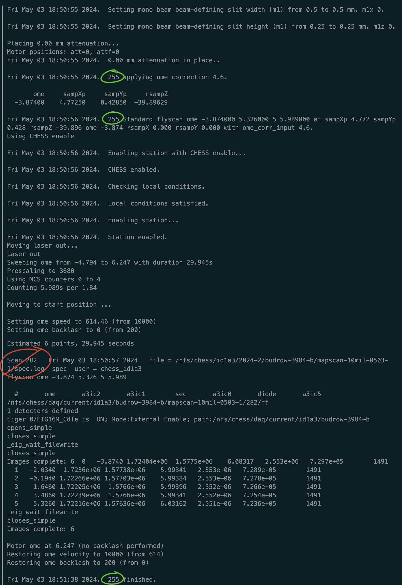
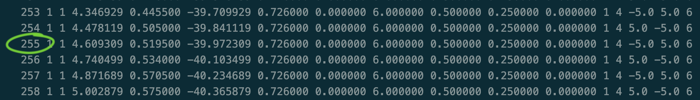

## Recovering a mapscan  
K. Nygren 2024-2

### Data Collection Interruption : triggering holding patterns

Mapscans will go into automatic holding patterns in the event of a loss of local_enable condition or insufficient flux in the hutch. This means in the event of a beamloss, the scans will go into a holding pattern until the local_enable condition is met and ion chamber a3ic0 (first ion chamber in the hutch) has sufficient counts. 

Mapscans are made of up many **scans**. **Holding patterns** typically do not get triggered until the END of a **scan**.

This also enables hutch entry mid mapscan (e.g. to let a tour group view the hutch). Once the doors are open, beamstops shut and scans will automatically go into a holding pattern. Scans will resume after the hutch is secured and x-rays are measured in ion chamber a3ic0. 

If the scans are in a holding pattern - once the last scan is complete SPEC will indicate through a print statement. Here is an example during an mbmapscan where the local_enable is CHESS enable. 

~~~
Fri May 03 12:35:11 2024.  Zero/Low positron current... standby...
Fri May 03 12:44:42 2024.  CESR current above threshold.
Using CHESS enable
Fri May 03 12:44:42 2024.  Enabling station with CHESS enable...
Fri May 03 12:44:42 2024.  CHESS not enbabled. Stand by...
~~~
    
*In this case, the current in the beam and CESR reached a sufficent threshold, then the holding pattern continued until CHESS was enabled.*

### Data Collection Interruption : aborting and resuming a mapscan

Mapscans can be aborted by the user at anytime (`ctrl+c`) and resumed from any row (aka scan, aka line) of the input array. The interger number of the row. 

Record the integer scan identifier corresponds to the row in the input array of the scan that was aborted (NOT SCAN NUMBER ASSOCIATED WITH THE DATA FOLDER - these are two different numbers that have similar nomenclature). 

To find this for the scan that is aborted, look for the green circled numbers in the sequence. You can also see the last SUCCESSFUL scan in the "Scan# Finished" line. The scan that was aborted will be the next one in the sequence. 

Do NOT use the SPEC SCAN No. - this is circled in red and is not the number you need. 

In the input.txt file (typically named "OutputForSpec_*.txt) it corresponds to this number:

Once you have found the scan number, you can update the experiment *.mac  file (typically named with a date convention e.g. 2024-05-01.mac, located in the raw folder of the data collection directory) in the following way: 

~~~
mbmapscan input.txt <starting row number here>
~~~

`qdo` the .mac file and run the mapscans. 

### Data Collection Interruption : scans appear to be stalled, spec needs to be recovered and mapscans restarted

There are two common hangups that we have observed during our data collection that we do not have automated recovery routines:

1. EPICS error (presumed from a network glitch)
2. File writing gets hungup

For both cases, `ctrl+c` is likey necessary to return the SPEC prompt. If you `ctrl+c` twice, it can often lead to an ungraceful abort, and futher troubleshooting may be required to return spec to the correct state to continue scans (see next section).

Many times simply aborting the scans, and starting from the last scan in the sequence (per the instructions in the last sequence) do the trick. If it does not, try the troubleshooting below. 

## Recovering from an ungraceful / incomplete abort sequence 

If you know or suspect that SPEC is in a confused state or behaving poorly after an abort sequence, you may want to try the following: 

1. check the motors are where you expect them to be. For pseudo motors - this can be done by moving to a known ome and checking the galil non-macromotors have the same reading as before. For instance, move to a known ome from a time before the abort sequence, print the sampXp, sampYp, sampX, and sampY and make sure they show the expected values. 
2. `config` and `ctrl+c` to recompile the motor macros

If these do not work - start methodically troubleshooting to understand what is not communicating properly. Note: there are "cleanup" routines in many of the deeper macros that you can run as individual functions. 
