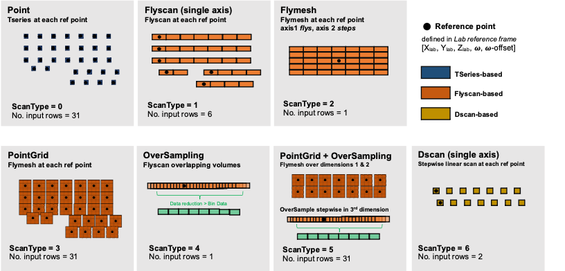

## Mapscans at 1A3 - Whitebeam and Monobeam

K.Nygren 2024-2 cycle

### Mapscans - Overview

Mapscans are ex-situ, powder-style (EDD or Monobeam Powder) datasets that **map** regions of the part in 3D (often at multiple rotations and/or configurations). 

The standard analysis strategies for mapscans rely on a very large number of grains to be present in the illumination volume - this can be achieved through: 1)small grained microstructures and/or 2) thicker sample volumes / larger illumination regions. For more details on what makes a good powder pattern - please see [insert user-facing web reference]. 

There are a series of common scan-types that are used for the mapping that make up the core of the scan strategy for a given mapscan. The seven current scantypes are illustrated in the figure below: 

A typicaly workflow for setting up a mapscan is as follows:

1. **Plan Mapscan**: Plan your scan strategy & data points knowing the nominal geometry of your sample and desired diffraction vectors (i.e. strain components). Identify fiducials for sample placement and configuration. Create a sample mounting plan. 

2. **Place Sample**: Place sample in the beam in a known configuration

3. **Align Sample**: Align the part to specified fiducials using the laser profiler and absorption readings on the diode from X-ray beam. 

4. **Laser-map Sample**: Run a LASER mapscan of the part (typically front and back when possible) at each point the measurements will be taken. 

5. **Write Input File**: Use the input file writer to generate the input array to execute your mapscan

6. **Take Mapscan**: Run the mapscan from the generated input textfile.  

7. **Analyze Data**: Analyze the mapscan data using the analysis workflows. 

### Plan Mapscan 

[here chris and i will detail basic principles of how we plan a mapscan and link to helpful python scripts]

### Place Sample

The sample should already have an obvious prescribe mounting scheme at this point. Place the sample in the beam in the nominally correct orientation. 

Important Checks: 
- **Sample collisions with laser arm and/or other objects** in the experimental station may not have been considered until now - excercise range of motion with the sample(s) mounted. If the sample cannot move/rotate through all degrees of freedome without colliding with an object, come up with a sample/equipment protection strategy or protocol for moving motors in a safe fashion. 
- **Sample weight and level-ness of stages**: depending on the weight of the sample, staging used, and placement of the sample on the staging - it is possible for the stages to move in and out of "level" when moving the object. Check this by placing a level on the stages and jogging the sample staging to the extents of travel. If you are moving out of level, the following can be tried:
    - position sample to another place on the stage
    - add counterweights (e.g. tungesten blocks) to balance out the weight on the stages
    - switch staging strategies (most dire option, but may need to be considered) 

### Align Sample 

#### Motors and Laser Positions used in Mapscan

For mapscans, a typical motor stage stack will be configured to move in along the *linear axes of the CHESS lab reference frame*, with a rotation stage about the vertical direction. 

| Direction w.r.t. Beam (facing downstream)| CHESS Lab Ref Frame | 
| --------------------- | ------------- | 
| transverse        | +X right  
| vertical          | +Z up    
| beam direction    | +Y      

Typical stage configurations for the Rhodes and Bose tables (where all linear stages are on top of the rotation stage) are as follows: 

| motion | Rhodes Motors | Bose Motors | Other Common |
|------ | ----- | ----- |-----|
| lab X | sampXp/sampXcp | bsampXp | samX
| lab Y | sampYp/sampYcp | bsampYp | samY
| lab Z | rsampZ         | bsampZ  | samZ
| omega | ome            | bome    | rot

where omega is the rotation about the vertical axis. 

If there is a rotation stage on top AND bottom of the linear stages, typically the same stage naming convention will be used without the 'p', pseudo motor, designation. In this motor stack configuration, the lower rotation stage aligns the linear stages with the lab-reference frame, and the top rotation stage squares the sample for measurements.  

The laser has been aligned to be INLINE with the X-ray beam when the laser is inserted. The laser reads ZERO at the rotation center of the stages (which in EDD is also the center of the EDD diffraction volume.)

#### Finding edges and fiducials

Typically we use a combination of the laser and the X-ray/diode readings to place the sample. 

Many samples have a flat face which can be registered to the reference frame. We use the laser for this process. 

- Squaring the sample can be performed the following way using the **laser**:
    - `laser_in` closes the shutter and puts the laser in the beam path 
    - `tw` appropriate psuedo motors to place sample face at the center of the beam (can do this looking at sample through PTZ camera)
    -   Place sample face near rotation center 
        - `get_keyence` *1* ; record Head A: value as distance1
        -  `umvr` *labymotor (+)distance1*
        -  get_keyence` *1* ; record Head A: should read zero now. 

    - square the sample: 
        - `dscan` *labxmotor -4 4 50 0.2* ; fit linear line
        - SPEC> deg(atan(slope)) ; record as square_ome somewhere
        - `umvr` *ome -(square_ome)*
        - `dscan` *labxmotor -4 4 50 0.2* ; verify sample is square by observing data. 
        - `wm` ome --- this is your "squared" omega position

- Finding sample fiducials/reference points for mapscan datapoint generation

    The datapoints are typically generated off of a fiducial/reference point(s) in the sample. These need to be scanned and their positions determined in the CHESS lab reference frame. 

- Make sure you are at the "squared" omega position found earlier. 

- move to a fiducial position
    - `laser_in` ; `tw` appropriate psuedo motors to be on/near the fiducial of interest (e.g. corner or edge or registration dimples)  
  
- most fiducials are chosen because they have some x-ray contrast as a feature. Use X-rays to find the x,z position of the fiducial

    - `laser_out` 
    - use `mbdscan` to find the feature x and z positions
    - `umv` to the positions in x and z
    - `print_positions` command will print the positions you are currently at. These will be the correct {ome, x, z} positions - the y position will be found next. 

- The y position can be found one of two ways: 

1. With X-rays:
    - `umvr` *ome 90* (or you can go a relative -90) - make sure you are on the fiducial 
    - `mbdscan` labxmotor (yes the lab x motor, remember when you rotate the sample, these motors will ALWAYS move in the laboratory reference frame). 
    - `umv` to the lab-x position appropriate. 
    - `umvr` *ome -90 (or the +90 to to back)
    - `print_positions` : record the print positions printout in the beamtime notes and label it as the fiducial. Some scripts have the data read in a different format - you can use `lazy_positions` to have it printed in that format. The format is as follows: 

        ~~~
        SPEC> print_positions
        ome 0.725 sampXp 2.456 sampYp -0.834 rsampZ -30.566

        ***
        ome_corr_input 0
        *** 

        rsampX 0.000 rsampY 0.000
        ~~~

        ~~~
        SPEC> lazy_positions
        ome = 0.725 
        sampXp = 2.456 
        sampYp = -0.834 
        rsampZ = -30.566
        ~~~

2. With the laser. 
